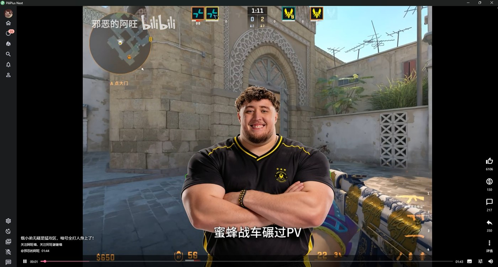
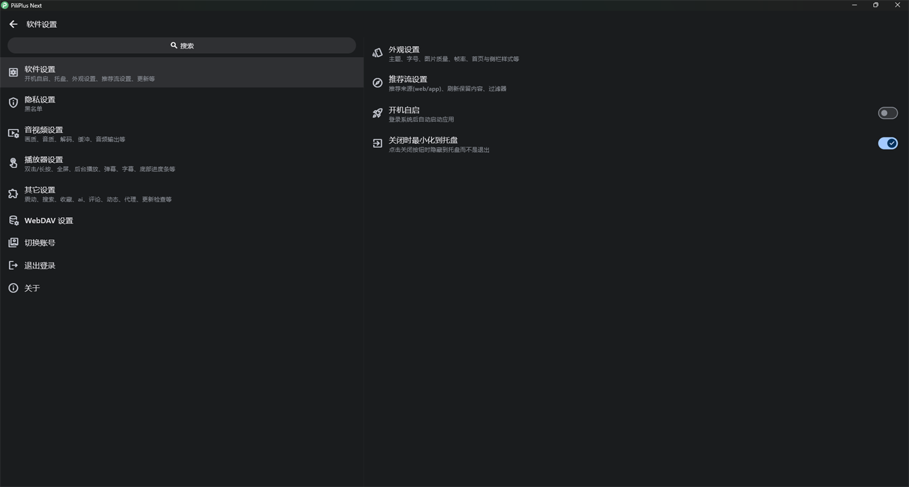

    

    <h1>PiliPlus Next</h1>
    
基于 <a href="https://github.com/bggRGjQaUbCoE/PiliPlus">PiliPlus</a> 的社区分支 —— 新增「精选」竖滑页，专注四平台适配与 Bug 修复

**中文** | [English](README.en.md)

> **源项目地址：https://github.com/bggRGjQaUbCoE/PiliPlus**
>
> 本项目 fork 自 PiliPlus 并在其基础上继续开发，感谢上游作者 [bggRGjQaUbCoE](https://github.com/bggRGjQaUbCoE) 及所有贡献者的开源精神。

---

## 预览

### 「精选」竖滑页（本分支新增）

抖音式竖向滑动推荐流，作为主界面的一个页签（**保留侧边栏**）。底部是 B站客户端同款的细轨进度条，右侧是完整操作栏，弹幕正常滚动：

这一页能做到什么（点开看细节）

- **底部控制条**：播放/暂停、当前时间、**可拖动**进度条、总时长、音量
- **弹幕**：正常显示并滚动；音量左侧有**弹幕开关**与**弹幕设置**面板（显示弹幕 / 不透明度 / 字体大小 / 显示区域），改完即时生效并写回偏好，与视频详情页同步
- **右侧操作栏**：点赞、投币、评论、转发（复制 B站链接）、详情
- **投币**用的是**原版**面板（1 币 / 2 币，可勾选「同时点赞」）
- **评论区**：点评论从**右侧展开**，左侧播放器自动缩窄；再点一次或点关闭按钮收起
- **键盘**：空格播放/暂停，上下方向键切换视频
- **鼠标滚轮**：一格一个切换，带 320ms 动画锁，不会连跳
- **切换视频不黑屏**：视频层常驻、翻页只重建文字与按钮，纹理不销毁重建
- 控制条**暂停时常驻、播放约 3 秒后自动滑出隐藏**，点画面或拖进度随时唤出

### 软件设置

新增「软件设置」分类，包含**开机自启**与**关闭时最小化到托盘**；开机自启的实际状态会与安装包选项保持同步：

---

## 本分支的特色功能

### 1. 「精选」竖滑页（核心新增）

上游没有这一页。它把推荐流做成了抖音式的竖向全屏视频流，交互上对齐 B站客户端与抖音：

| 能力 | 说明 |
| --- | --- |
| 竖向滑动切换 | 上下滑动 / 方向键 / 鼠标滚轮，一格一个 |
| 完整播放控制 | 进度条可拖动（细轨 + 缓冲条 + 圆点）、播放暂停、时长、音量 |
| 弹幕 | 显示与滚动，并提供**弹幕开关**与**弹幕设置**面板 |
| 互动 | 点赞、**原版投币面板**、评论、转发（复制链接）、进入详情页 |
| 评论区 | 从右侧展开，播放器自动缩窄（抖音式） |
| 键盘 | 空格播放/暂停、上下方向键切换 |
| 无黑屏切换 | 视频层常驻，翻页不重建纹理 |

### 2. 桌面端界面重做

- **纯图标侧边栏**（所有非竖屏布局生效），设置入口保留
- **播放器音量按钮**
- **视频页宽屏布局**重做：左侧播放器 / 右侧简介 + 评论
- 横屏时播放器下方空白用纯文字简介填充
- 清理「我的」页头部残留的操作按钮

### 3. 软件设置

- 新增「软件设置」分类：**开机自启**、**关闭时最小化到托盘**
- **开机自启状态与安装包保持同步**（此前安装时勾选了，装完在设置里却显示未开）

### 4. 上游 Bug 修复

- 一次性修复 **9 个上游 issue**：`#3086` `#3107` `#3036` `#3049` `#3082` `#2422` `#2955` `#3136` `#3071`
- **分P续播**：修复「切分P再切回、该分P从头播放」(`#2916` `#3139`)，已向上游提交 PR [#3237](https://github.com/bggRGjQaUbCoE/PiliPlus/pull/3237)
- 修复**设置页白屏**（`RegCloseKey` 导出名问题）
- 详情页分P嵌套列表、字幕、搜索结果等零散问题

完整清单与进度见 [docs/BUGFIX.md](docs/BUGFIX.md)（对上游开放 issue 做过系统分诊，去重后 79 组）。

---

## 与原版的差异一览

下表是本分支相对上游 [PiliPlus](https://github.com/bggRGjQaUbCoE/PiliPlus) 的**全部自有改动**（不含同步上游的部分）：

| 类别 | 内容 |
| --- | --- |
| **新增页面** | 「精选」竖滑页（含进度条、弹幕设置、操作栏、右侧评论区、键盘与滚轮控制） |
| **桌面端** | 纯图标侧边栏、播放器音量按钮、宽屏视频页布局、横屏简介填充 |
| **设置** | 「软件设置」分类（开机自启 / 最小化到托盘）、自启状态与安装包同步 |
| **Bug 修复** | 9 个上游 issue、分P续播、设置页白屏 |
| **平台** | 构建与发布 **Windows / Android / macOS / iOS** 四平台产物。Linux：`linux/` 脚手架与上游的 `linux_x64.yml` 工作流**保留但未维护**，本分支不构建、不发布 Linux 产物。HarmonyOS：曾试做脚手架（`ohos/`）后**已移除** |
| **工程** | `patch.ps1` 在 Windows 上的 pub 缓存路径修正、`build.ps1` 的 `GITHUB_ENV` 守卫、Gradle 镜像 |

---

## 适配平台

- [x] Android
- [x] Windows（Inno Setup 安装包）
- [x] macOS（CI 构建 DMG）
- [x] iOS（CI 构建未签名 ipa，供侧载）

> Linux 与 HarmonyOS **不在本分支的构建与发布范围内**（Linux 脚手架与上游工作流仍保留在仓库里但未维护，HarmonyOS 脚手架已移除），详见上方[与原版的差异一览](#与原版的差异一览)。

## 下载

- 从本仓库 [Releases](https://github.com/having5548/PiliPlus-Next/releases) 下载
- 或克隆仓库后在本地编译（见下一节）

## 从源码构建

> **构建前必读**：本项目依赖一组 **Flutter SDK 补丁**，**不运行补丁脚本无法编译**。

1. 通过 git clone 安装 **Flutter 3.47.6 stable**（版本锁在 `.fvmrc`，补丁按此版本制作）
2. 设置环境变量：
   - `FLUTTER_ROOT` → Flutter SDK 目录
   - `GITHUB_WORKSPACE` → 本仓库根目录
3. `flutter pub get`
4. 运行 `pwsh lib/scripts/patch.ps1 <platform>`
   （`platform` = `android` / `windows` / `macos` / `ios`；脚本会把补丁应用到 Flutter SDK 以及 pub 缓存中的 `material_ui` / `cupertino_ui` 包）
5. 生成版本信息 `pwsh lib/scripts/build.ps1`（依赖 git 历史），或手工创建 `pili_release.json`
6. 构建：
   - Android：`flutter build apk --release --split-per-abi --dart-define-from-file=pili_release.json --no-pub`
   - Windows：`flutter build windows --release --dart-define-from-file=pili_release.json --no-pub`
   - macOS / iOS：推送 tag 由 GitHub Actions 构建（`.github/workflows/mac.yml` / `ios.yml`）

> **关于 Flutter 版本**：上游 `.fvmrc` 已声明 `3.47.7`，但跟进它需要重新下载 SDK 并重打全部补丁。本分支实测 **3.47.6 可正常编译上游代码**（`dart analyze` 零 error，四平台构建通过），因此暂以 3.47.6 构建；跟进 3.47.7 会作为后续单独一步。

## 主要功能

上游原有的完整功能全部保留，包括：

- 推荐/热门/分区视频浏览，直播、番剧、影视、专栏
- 视频播放：弹幕（高级弹幕/合并/会员彩色弹幕）、字幕、倍速、画质音质解码切换、超分辨率、SponsorBlock、高能进度条、DLNA 投屏、画中画、离线缓存
- 动态：浏览/发布/转发/投票/话题，富文本编辑
- 评论：楼中楼、带图评论、排序、置顶、点踩
- 直播：弹幕互动、表情、分区、舰长标识
- 消息：站内私信、回复/艾特提醒、聊天设置
- 账号：多账号、无痕/游客模式、Cookie 登录、WebDAV 备份
- 其他：稍后再看、收藏夹管理、笔记、互动视频、跳过片头片尾、AI 原声翻译等

完整清单见[源项目 README](https://github.com/bggRGjQaUbCoE/PiliPlus#readme)。

## 反馈问题

提交 issue 前请先搜索 [docs/BUGFIX.md](docs/BUGFIX.md) 与已有 issue —— 本分支对上游开放 issue 做过系统分诊，重复问题会被合并关闭。

## 致谢（按时间顺序）

本项目的诞生离不开以下项目：

- [guozhigq/pilipala](https://github.com/guozhigq/pilipala) —— 原始作者
- [orz12/PiliPalaX](https://github.com/orz12/PiliPalaX) —— 上游分支作者
- [bggRGjQaUbCoE/PiliPlus](https://github.com/bggRGjQaUbCoE/PiliPlus) —— 本项目的直接源项目
- [bilibili-API-collect](https://github.com/SocialSisterYi/bilibili-API-collect) —— B 站 API 文档
- [media-kit](https://github.com/media-kit/media-kit) —— 跨平台播放器
- [flutter_meedu_videoplayer](https://github.com/zezo357/flutter_meedu_videoplayer)

## 声明

- 本项目是个人为了兴趣而开发，仅用于学习和测试，请于下载后 24 小时内删除
- 所用 API 皆从官方网站收集，不提供任何破解内容
- 本项目基于 [PiliPlus](https://github.com/bggRGjQaUbCoE/PiliPlus) 修改，依据 **GNU GPL-3.0** 许可证开源分发，许可证全文见 [LICENSE](LICENSE)。修改内容为本仓库新增的提交，原版权与许可证声明均予保留

## Star History

